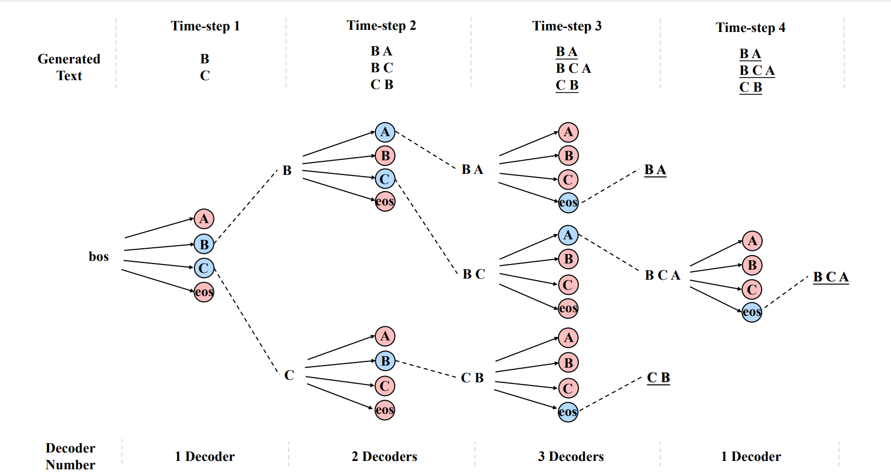

# One2Branch

Code for "[A BRANCHING DECODER FOR SET GENERATION](https://openreview.net/pdf?id=riNuqYiD66)" (ICLR 2024)

We propose a branching decoder, which can generate a dynamic number of tokens at each time-step
and branch multiple generation paths. In particular, paths are generated individually so that no order dependence is required. Moreover, multiple paths can be
generated in parallel which greatly reduces the inference time. 


We implement branching decoder based on the code of HuggingFace T5.
The code of the architecture of One2Branch is  [models/modeling_t5_branching.py](https://github.com/nju-websoft/One2Branch/blob/main/models/modeling_t5_branching.py)
The code of decoding One2Branch is the function branching_decoding() in [models/generation/utils.py](https://github.com/nju-websoft/One2Branch/blob/main/models/generation/utils.py)




## Installation
```angular2html
pip install -r requirements.txt
```

## How to run 
run_one2branch_kp.py is the code for one2branch training and inference on keyphrase generation datasets.
You can use the script 'script_branch_kp.sh' to run it 

```
bash script_branch_kp.sh
```

## Dataset
We upload the in-house split MSQA dataset with and a small set of keyphrase generation datasets.
The complete keyphrase generation datasets can be downloaded from [here](https://drive.google.com/file/d/16d8nxDnNbRPAw2pVy42DjSTVnT0WzJKj/view), which are the tokenized version of the datasets provided by [Ken Chen](https://github.com/kenchan0226/keyphrase-generation-rl).


## Reference
Please cite this paper in your publications if it helps your research:

```

@inproceedings{huang2023branching,
  title={A Branching Decoder for Set Generation},
  author={Huang, Zixian and Xiao, Gengyang and Gu, Yu and Cheng, Gong},
  booktitle={The Twelfth International Conference on Learning Representations},
  year={2023}
}

```